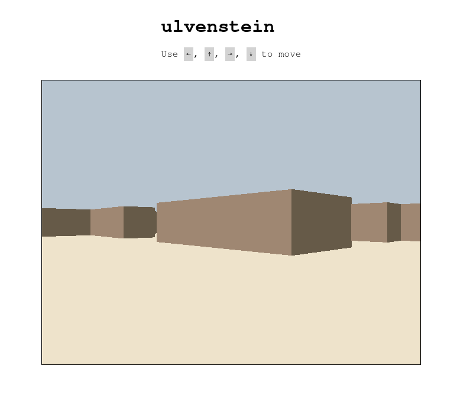

[Live demo](https://ericwoude.github.io/ulvenstein/)

This repository features a web assembly demo of a Wolfenstein3D–inspired ray casting renderer. Special thanks to [Lode's Computer Graphics Tutorial](https://lodev.org/cgtutor/raycasting.html) for providing an excellent source on building a raycaster.

## Building
1. The first step is to build the wasm pkg
```bash
$ wasm-pack build --target web
```

2. Next, host the files using a server—e.g., with Python.
```bash
$ python -m http.server
```

## Controls
Use `←`, `↑`, `→`, `↓` to walk to the respective direction.
